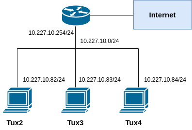
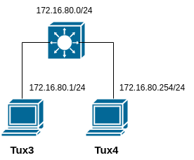
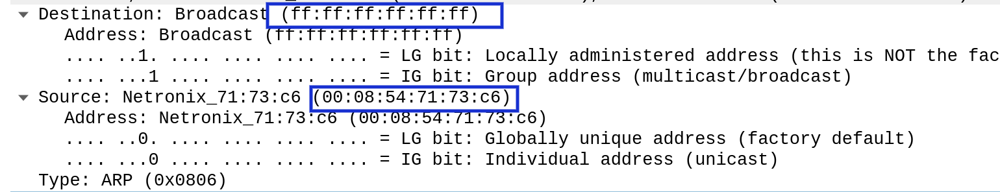
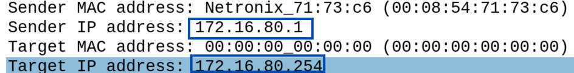

# Experiência 1
A experiência foi realizada na bancada nº8, logo o valor de Y = 8.
## Objetivo da experiêcia
A primeira experiência tem como objetivo principal, perceber os conceitos bases de uma rede através da interconexão de dois computadores através de um switch. **Nota** - O switch utilizado na experiência é da camada 3 e portanto também têm funcionalidades de router.
## Arquitetura da rede
A arquitetura divide-se em duas redes principais:

 - **Internet** - A rede que conecta os computadores Tux á Internet não sofre alterações ao longo das experiências, e, por isso, os detalhes dessa rede não são aprofundados.

    - **IP da rede** - 10.227.10.0/24
    - **IP tux2** - 10.227.10.82/24
    - **IP tux3** - 10.227.10.83/24
    - **IP tux4** - 10.227.10.84/24
    - **IP RLAB** - 10.227.10.254/24 (router do laboratório)
    - **IP broadcast** - 10.227.10.255/24

    
- **NOTA** - Os 24 bits de máscara indicam que 1 byte de 32 bits, serve exlcusivamente para representar hosts (.0 - rede, .255 -broadcast)
 - **Rede da experiência 1** - A primeira rede configurada nas aulas laboratoriais é composta por dois computadores, designados como tux3 e tux4, e por um switch Mikrotik Router Switch.

    - **IP da rede** - 172.16.80.0/24
    - **IP do tux3** - 172.16.80.1/24
    - **IP do tux4** - 172.16.80.254/24
    - **IP broadcast** - 172.16.80.255/24
    


## Comandos

**1** - Restaurar dados e configurações de fábrica do Mikrotik Router Switch. (**GTKterminal**)
```bash
/system reset-configuration
y #(y-reset, n-keep configurations)
[Enter]
```
O computador escolhido para correr o GTKterminal foi o **tux3**.

**2** - Ligar cabos.
| Placa rede | Switch (porta) |
|----------|----------|
| gnu13-e1 | 3        |
| gnu14-e1 | 4        |
| gtk13-s0 | 0 |

**3** - Configurar ip dos hosts nas interfaces de rede e verificar que os ip's foram bem configurados.

```bash
ifconfig eth1 172.16.80.1/24 # Tux83 ip
```
```bash
ifconfig eth1 172.16.80.254/24 # Tux84 ip
```
```bash
ifconfig 
```
**4** -  Endereços MAC 
| tux | MAC |
|----------|----------|
| tux83 | 00:08:54:71:73:c6 |
| tux84 | 00:c0:df:08:d5:b0 |

**5** - Usar o comando ping para verifica conectividade entre computadores.

```bash
ping '172.16.80.254' # Comando realizado a partir do tux83 para verificar conectividade com tux84
```
```bash
ping '172.16.80.1' # Comando realizado a partir do tux84 para verificar conectividade com tux83
```
Se pacotes ICMP forem recebidos, a conexão entre os dois computadres verifica-se.

**6** - Inspecionar as tabelas de routing e tabelas arp.

```bash
route -n
```
```bash
arp -a
```
**7** - No tux83 eliminar todas as tabelas da entrada arp.

```bash
arp -d -a
```
**8** -  Abrir o wireshark no tux83 e capturar pacotes.

**9** - Usar o comando ping do tux83 para o tux84.

```bash
ping '172.16.80.254' # Comando realizado a partir do tux83 para verificar conectividade com tux84
```
**10** - Guardar os resultados do Wireshark.

### Perguntas 
#### O que são os pacotes ARP e para que são usados?
O ARP (Address Resolution Protocol) é o protocolo de resolução de endereços, utilizado na camada de enlace para descobrir o endereço MAC de um dispositivo a partir do seu endereço IP.

Por exemplo, quando o tux3 quer comunicar com o tux4, é possível verificar a conectividade entre eles utilizando o comando ping. Se a cache ARP do tux3 já contiver o endereço MAC do tux4, basta enviar os pacotes ICMP diretamente. No entanto, se o endereço MAC não estiver na cache, pacotes ARP serão enviados para o endereço broadcast da rede. Isso significa que todos os dispositivos conectados à rede irão receber o pacote ARP. O dispositivo que possuir o IP de destino responderá com um pacote ARP contendo o seu endereço MAC associado, permitindo que o tux3 complete a comunicação com o tux4.


Existem dois tipos de pacotes ARP:

**ARP-request** - Este pacote é um pacote de broadcast. 
**ARP-response** - Este pacote contém o MAC do destino.


#### O que são os endereços MAC e IP dos pacotes ARP?
O endereço IP pertence à camada de rede (terceira camada do modelo TCP/IP) e serve como identificador lógico de um dispositivo na rede. Por outro lado, o endereço MAC é atribuído pelo fabricante da interface de rede e, geralmente, é imutável.

Ambos os endereços são essenciais para a comunicação eficiente em redes de computadores. O endereço IP identifica o dispositivo no nível lógico, permitindo a comunicação entre redes diferentes, enquanto o endereço MAC é usado em switches para identificar fisicamente o dispositivo dentro de uma rede local (LAN). Assim, os IPs possibilitam o roteamento, e os endereços MAC garantem a entrega dos pacotes no destino correto na camada de enlace.

- **ARP request**

    - MAC src - Endereço mac do tux que faz o ping
    - MAC dst - Endereço mac broadcast (ff:ff:ff:ff:ff)
    - IP src - Endereço ip do tux que faz o ping
    - IP dst - Endereço ip do tux destino

- **ARP reply**
    - MAC src - Endereço mac do tux que responde.
    - MAC dst - Endereço mac do tux que faz o ping
    - IP src - Endereço ip do tux destino
    - IP dest - Endereço ip do tux que faz o ping

**Exemplo dos logs** - Ping tux4 (tux3->tux4)
- **ARP request**





- **ARP reply**


#### Como determinar o tipo da trama?
As tramas ethernet recebidas no wireshark têm sempre um protocolo associado (ARP,ICMP,STP...).


#### Como determinar o tamanho de uma trama?
As tramas são as unidades de transmissão de dados na camada de enlace. A partir do wireshark é possivel determinar o tamanho de qualquer frame.


#### O que é a loopback interface, e porque é importante?
A inteface de loopback é uma interface de rede virtual, que serve para testar o funcionamento da stack de protocolos TCP/IP no próprio computador. O ip. **O ip da interface de loopback é 127.0.0.1/8**. 


### Análise dos logs
