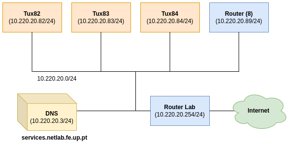
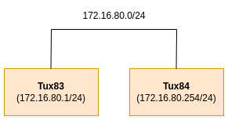
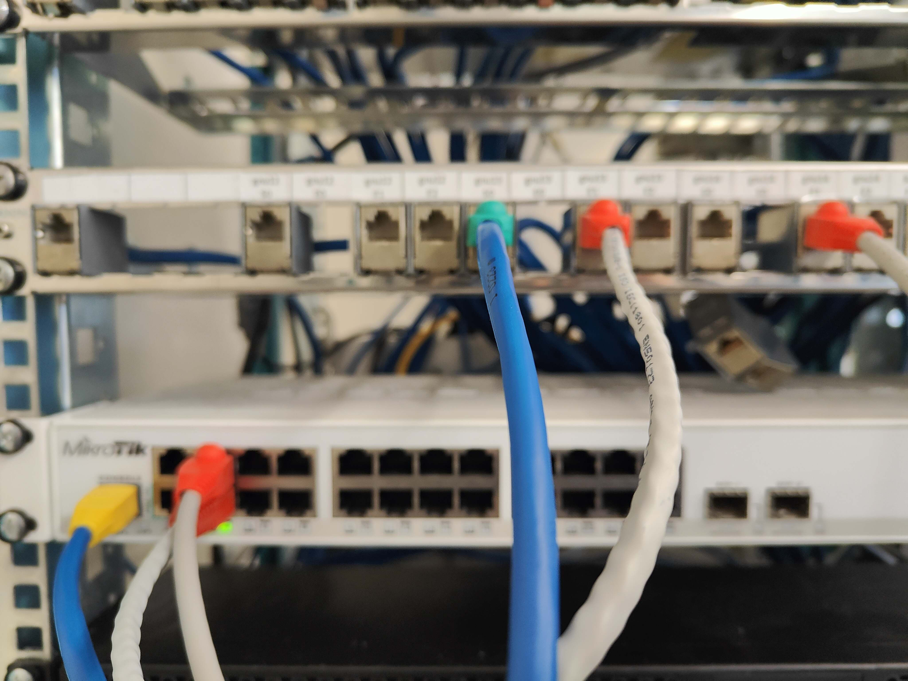

# Experiência 1
A experiência foi realizada na bancada nº8, logo o valor de Y = 8.
## Objetivo da experiêcia
A primeira experiência tem como objetivo principal, perceber os conceitos bases de uma rede através da interconexão de dois computadores através de um switch.

## Arquitetura da rede
A arquitetura divide-se em duas redes principais:

 - **Internet** - A rede que conecta os computadores Tux á Internet não sofre alterações ao longo das experiências, e, por isso, os detalhes dessa rede não são aprofundados.

    - **IP da rede** - 10.227.10.0/24
    - **IP tux2** - 10.227.10.82/24
    - **IP tux3** - 10.227.10.83/24
    - **IP tux4** - 10.227.10.84/24
    - **IP router comercial** - 10.227.10.89/24
    - **IP serviços DNS** - 10.227.10.3/24
    - **IP RLAB** - 10.227.10.254/24 (router do laboratório)
    - **IP broadcast** - 10.227.10.255/24


    

    
 - **Rede da experiência 1** - A primeira rede configurada nas aulas laboratoriais é composta por dois computadores, designados como tux3 e tux4, e por um switch Mikrotik Router Switch.

    - **IP da rede** - 172.16.80.0/24
    - **IP do tux3** - 172.16.80.1/24
    - **IP do tux4** - 172.16.80.254/24
    - **IP broadcast** - 172.16.80.255/24

    


## Configuração dos cabos
### Switch 
|Régua | Switch (porta)|
|----------|----------|
| gnu13-e1 | 3        |
| gnu14-e1 | 4        |

### Consola
Em todas as experiência o GTKterminal está conectado no gnu13-s0. Isto significa que só é possivel aceder ás funcionalidades do GTKterminal a partir do Tux83. (RS232->cisco para gnu13-s0)
Dentro do GTKterminal, podemos alterar funcionalidades do switch ou do router comercial. Se quiser usar o switch ligo um cabo de rs232 a porta consola do switch (cisco->RS232 para console). Se quiser usar o router ligo um cabo de rs232 a porta router MTIK da régua.



**Cabo amarelo** -> Determina qual dispositivo o GTKterminal está ligado.
**Cabo verde** -> Determina qual dos tuxes está a ser usado para o GTKterminal.

## Comandos

### Eliminar configurações antigas
**1** - Reiniciar todos os tuxes usados nas seguintes experiências (tux82,tux83,tux84).
**2** - Em todos os tuxes reiniciar o serviço de redes.
```bash
systemctl restart networking
```
**3** - Restaurar dados e configurações de fábrica do Mikrotik Router Switch. (**GTKterminal**) (Tux83)
```bash
/system reset-configuration
y #(y-reset, n-keep configurations)
[Enter]
```
**4** - Restaurar dados e configurações de fábrica do Router comercial  (**GTKterminal**) (Tux83) (Trocar **cabo amarelo** para o router MTIK)
```bash
/system reset-configuration
y #(y-reset, n-keep configurations)
[Enter]
```
### Experiência 1

**1** - Configurar IP's

**Tux83** 
```bash
ifconfig eth1 up #(C) Ativar interface de rede
ifconfig eth1 172.16.80.1/24 #Tux83(C)
ifconfig # Verificar
```
**Tux84** 
```bash
ifconfig eth1 up #(C) Ativar interface de rede
ifconfig eth1 172.16.80.254/24 #(C) Tux84
ifconfig # Verificar
```
**2** - Verificar endereços MAC e endereços IP (ifconfig)
| tux | MAC | IP |
|----------|----------| -------- |
| tux83 | 00:08:54:71:73:c6 | 172.16.80.1/24 |
| tux84 | 00:c0:df:04:a2:6d | 172.16.80.254/24 |

**3** - Usar o comando ping para verifica conectividade entre computadores.

**Tux83**
```bash
    ping '172.16.80.254' # tux83 -> tux84
```
**Tux84**
```bash
    ping '172.16.80.1' # tux84 -> tux83
```

**6** - Inspecionar as tabelas de routing e tabelas arp.
```bash
    arp -a # Tabela arp (IP -> MAC)
    route -n # Tabela route (rotas na rede).
```

**7** - Eliminar todas as entradas da tabela arp.
**Tux83**
```bash
arp -a # Quais são as entradas da tabela arp
arp -d <IP-ADDRESS>
```
**8** - Ping tux84

**tux83**
```bash
ping '172.16.80.254' #tux83 -> tux84
```
Verificar os pacotes que tux4 recebe (**Wireshark**)
