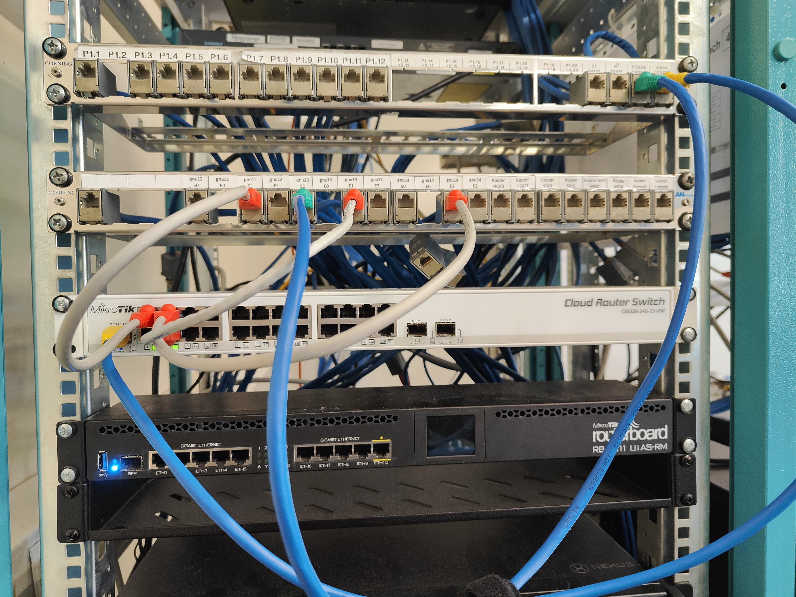

# Experiência 2 
**!!!!!!!Fazer primeiro  experiências anteriores (1)**
A experiência foi realizada na bancada nº8, logo o valor de Y = 8.

## Objetivo da experiêcia
A segunda experiência tem como objetivo principal ensinar como usar bridges, que permitem a criação de duas sub-redes virtuais dentro do mesmo switch.

## Arquitetura da rede
**Rede da experiência 2** - A segunda rede configurada nas aulas laboratoriais é composta por três computadores, designados como tux2, tux3 e tux4, e por um switch Mikrotik Router Switch. Estes 3 computadores estarão dividos em duas bridges, bridge80 e bridge81.

- **IP da subrede 80** - 172.16.80.0/24
- **IP da subrede 81** - 172.16.81.0/24
- **IP do tux2** - 172.16.81.1/24
- **IP do tux3** - 172.16.80.1/24
- **IP do tux4** - 172.16.80.254/24
- **IP broadcast (subrede 80)** - 172.16.80.255/24
- **IP broadcast (subrede 81)** - 172.16.81.255/24


## Configuração dos cabos
### Switch 
|Régua | Switch (porta)|
|----------|----------|
| gnu12-e1 | 2        |
| gnu13-e1 | 3        |
| gnu14-e1 | 4        |

### Consola
Em todas as experiência o GTKterminal está conectado no gnu13-s0. Isto significa que só é possivel aceder ás funcionalidades do GTKterminal a partir do Tux83. (RS232->cisco para gnu13-s0)
Dentro do GTKterminal, podemos alterar funcionalidades do switch ou do router comercial. Se quiser usar o switch ligo um cabo de rs232 a porta consola do switch (cisco->RS232 para console). Se quiser usar o router ligo um cabo de rs232 a porta router MTIK da régua.



**Cabo amarelo** -> Determina qual dispositivo o GTKterminal está ligado.
**Cabo verde** -> Determina qual dos tuxes está a ser usado para o GTKterminal.

## Comandos

### Experiência 2

**1** - Configurar IP's

**Tux82** 
```bash
ifconfig eth1 up # (C) Ativar interface de rede
ifconfig eth1 172.16.81.1/24 # (C) Tux82
ifconfig # Verificar
```

**2** - Verificar endereços MAC e endereços IP (ifconfig)
| tux | MAC | IP |
|----------|----------| -------- |
| tux82 | 00:08:54:50:3b:b3 | 172.16.81.1/24 |


**3** - Adicionar bridges e portas respetivas de cada tux á sua bridge.
**Tux83 (GTKterminal)**
```bash

# Nomes das bridges (C)
/interface bridge add name=bridge80
/interface bridge add name=bridge81
# Remove bridges antigas (C)
/interface bridge port remove [find interface =ether2] # Tux 82
/interface bridge port remove [find interface =ether3] # Tux 83
/interface bridge port remove [find interface =ether4] # Tux 84
# Adicionar bridges novas (C)
/interface bridge port add bridge=bridge81 interface=ether2 #Tux 82
/interface bridge port add bridge=bridge80 interface=ether3 #Tux 83
/interface bridge port add bridge=bridge80 interface=ether4 #Tux 84
## Verificar
/interface bridge print
/interface bridge port print
/interface bridge port print brief
```

**4** - Ping tux84 e tux82
**Tux83** (!EM FALTA)
```bash
    ping 172.16.80.254 # tux83 -> tux84
    ping 172.16.81.1 # tux83 -> tux82
```
Verificar os pacotes que tux2 e tux4 recebem (**Wireshark**)

**5** - Ping broadcast da subrede 80
**Tux83**
```bash
    ping 172.16.80.255 #tux83 -> broadcast
```
Verificar os pacotes que tux2, tux3 e tux4 recebem (**Wireshark**)

**6** - Ping broadcast da subrede 81
**Tux82**
```bash
    ping 172.16.81.255 #tux82 -> broadcast
```
Verificar os pacotes que tux2, tux3 e tux4 recebem (**Wireshark**)


