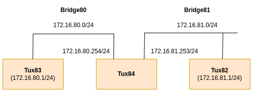
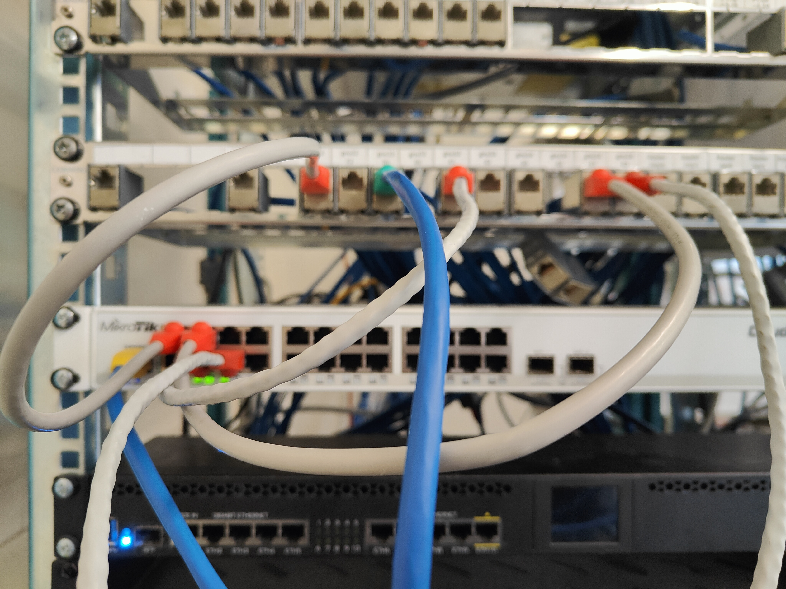

# Experiência 3
A experiência foi realizada na bancada nº8, logo o valor de Y = 8.

## Objetivo da experiêcia
A terceira experiência tem como objetivo principal tornar o tux84 num router.

## Arquitetura da rede
**Rede da experiência 3** - A terceira rede configurada nas aulas laboratoriais é composta por três computadores, designados como tux2, tux3 e tux4, e por um switch Mikrotik Router Switch. Estes 3 computadores estarão dividos em duas bridges, bridge80 e bridge81.

- **IP da subrede 80** - 172.16.80.0/24
- **IP da subrede 81** - 172.16.81.0/24
- **IP do tux2** - 172.16.81.1/24
- **IP do tux3** - 172.16.80.1/24
- **IP do tux4 (eth1)** - 172.16.80.254/24
- **IP do tux4 (eth2)** - 172.16.81.253/24
- **IP broadcast (subrede 80)** - 172.16.80.255/24
- **IP broadcast (subrede 81)** - 172.16.81.255/24




## Configuração dos cabos
### Switch 
|Régua | Switch (porta)|
|----------|----------|
| gnu12-e1 | 2        |
| gnu13-e1 | 3        |
| gnu14-e1 | 4        |
| gnu14-e2 | 5        |


### Consola
Em todas as experiência o GTKterminal está conectado no gnu13-s0. Isto significa que só é possivel aceder ás funcionalidades do GTKterminal a partir do Tux83. (RS232->cisco para gnu13-s0)
Dentro do GTKterminal, podemos alterar funcionalidades do switch ou do router comercial. Se quiser usar o switch ligo um cabo de rs232 a porta consola do switch (cisco->RS232 para console). Se quiser usar o router ligo um cabo de rs232 a porta router MTIK da régua.



**Cabo amarelo** -> Determina qual dispositivo o GTKterminal está ligado.
**Cabo verde** -> Determina qual dos tuxes está a ser usado para o GTKterminal.

## Comandos

### Experiência 3

**1** - Configurar IP's

**Tux84** 
```bash
ifconfig eth2 up # (C) Ativar interface de rede
ifconfig eth2 172.16.81.253/24 # (C) Tux84
ifconfig # Verificar
```

**2** - Verificar endereços MAC e endereços IP (ifconfig)
| tux | MAC | IP |
|----------|----------| -------- |
| tux84-eth1 | 00:c0:df:04:a2:6d | 172.16.80.254/24 |
| tux84-eth2 | 00:c0:df:08:d5:b0 | 172.16.81.253/24 |


**3** - Adicionar bridges e portas respetivas de cada tux á sua bridge.

**Tux83 (GTKterminal)**
```bash

# Remove bridges antigas (C)
/interface bridge port remove [find interface =ether5] # Tux 84
# Adicionar bridges novas (C)
/interface bridge port add bridge=bridge81 interface=ether5 #Tux 84
## Verificar
/interface bridge print
/interface bridge port print
/interface bridge port print brief
```

**4** - Ativar IP-forwarding e desativar ICMP-echo-broadcast

**Tux84**
```bash 
sysctl net.ipv4.ip_forward=1 # (C)
sysctl net.ipv4.icmp_echo_ignore_broadcasts=0 # (C)
```
**5** - Adicionar rotas no tux83 e no tux82

**tux82**
```bash 
route add -net 172.16.80.0/24 gw 172.16.81.253 # (C)
route -n # Verificar
```
**tux83**
```bash 
route add -net 172.16.81.0/24 gw 172.16.80.254 # (C)
route -n # Verificar
```

**6** - Ping a todas as interfaces de rede

**Tux83**
```bash
    ping 172.16.80.254 # tux83 -> tux84.eth1
    ping 172.16.81.253 # tux83 -> tux84.eth2
    ping 172.16.81.1 # tux83 -> tux82
```
Verificar os pacotes que tux3 (**Wireshark**)

**7** - Limpar todas as tabelas arp de todos os tuxes

**8** -  Ping tux2

**tux83**

```bash
    ping 172.16.81.1 # tux83 -> tux82
```

Verificar os pacotes que tux4.eth1 e tux4.eth2 recebem (**Wireshark**)
