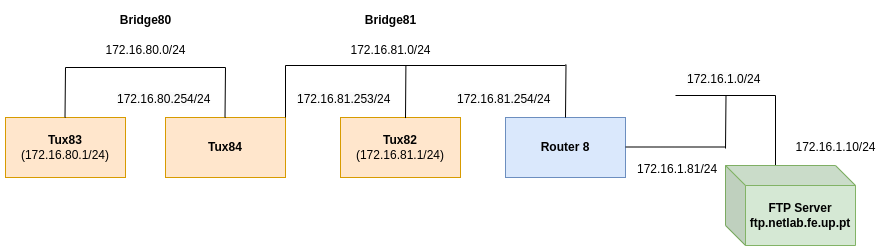

# Experiência 4
A experiência foi realizada na bancada nº8, logo o valor de Y = 8.

## Objetivo da experiêcia
A quarta experiência tem como objetivo principal configurar um router comercial e perceber a funcionalidade do NAT.

## Arquitetura da rede
**Rede da experiência 4** - A quarta rede configurada nas aulas laboratoriais é composta por três computadores, designados como tux2, tux3 e tux4, por um switch Mikrotik Router Switch e por um router comercial.Os três computadores e o router comercial estão dividos em duas bridges, bridge80 e bridge81.

- **IP da subrede 80** - 172.16.80.0/24
- **IP da subrede 81** - 172.16.81.0/24
- **IP do tux2** - 172.16.81.1/24
- **IP do tux3** - 172.16.80.1/24
- **IP do tux4 (eth1)** - 172.16.80.254/24
- **IP do tux4 (eth2)** - 172.16.81.253/24
- **IP router comercial (eth1)** - 172.16.1.81/24
- **IP router comercial (eth2)** - 172.16.81.254/24
- **IP broadcast (subrede 80)** - 172.16.80.255/24
- **IP broadcast (subrede 81)** - 172.16.81.255/24




## Configuração dos cabos
### Switch 
|Régua | Switch (porta)|
|----------|----------|
| gnu12-e1 | 2        |
| gnu13-e1 | 3        |
| gnu14-e1 | 4        |
| gnu14-e2 | 11        |
| router (eth2) | 6   |


### Consola
Em todas as experiência o GTKterminal está conectado no gnu13-s0. Isto significa que só é possivel aceder ás funcionalidades do GTKterminal a partir do Tux83. (RS232->cisco para gnu13-s0)
Dentro do GTKterminal, podemos alterar funcionalidades do switch ou do router comercial. Se quiser usar o switch ligo um cabo de rs232 a porta consola do switch (cisco->RS232 para console). Se quiser usar o router ligo um cabo de rs232 a porta router MTIK da régua.


**Cabo amarelo** -> Determina qual dispositivo o GTKterminal está ligado.
**Cabo verde** -> Determina qual dos tuxes está a ser usado para o GTKterminal.

### Router
router(eth1) -> P1.12

## Comandos

### Experiência 3

**1** - Ligar router comercial ao switch na bridge81 e adicionar ip's do router

**Tux83** 
```bash
# (GTKterminal switch)
# Remove bridges antigas (C)
/interface bridge port remove [find interface =ether6] # Tux 84
# Adicionar bridges novas (C)
/interface bridge port add bridge=bridge81 interface=ether6 #Tux 84
## Verificar
/interface bridge print
/interface bridge port print
/interface bridge port print brief

# (Router comercial)
# Adicionar ip's (C)
/ip address add address=172.16.1.81/24 interface=ether1
/ip address add address=172.16.81.254/24 interface=ether2
```

**2** - Verificar e adicionar rotas (Algumas rotas podem já estar feitas da exp3) .

**Tux82**
```bash
route -n # Verificar
route add -net 172.16.1.0/24 gw 172.16.81.254 # (C)
route add -net 172.16.80.0/24 gw 172.16.81.253 # (C)
route -n # Verificar
```

**Tux83**
```bash
route -n # Verificar
route add -net 172.16.1.0/24 gw 172.16.80.254 # (C)
route add -net 172.16.81.0/24 gw 172.16.80.254 #(C)
route -n # Verificar
```

**Tux84**
```bash
route -n # Verificar
route add -net 172.16.1.0/24 gw 172.16.81.254 # (C)
route -n # Verificar
```

**Router comercial (Tux83 GTKterminal do router comercial)**
```bash
/ip route add dst-address=172.16.80.0/24 gateway=172.16.81.253 # (C)
/ip route print # Verificar
```

**3** - Ping a todas as interfaces de rede

**Tux83**
```bash
    ping 172.16.80.254 # tux3 -> tux4.eth1
    ping 172.16.81.253 # tux3 -> tux4.eth2
    ping 172.16.81.1 # tux3 -> tux2
    ping 172.16.81.254 # tux3 -> router.eth2
    ping 172.16.1.81 # tux3 -> router.eth1
```
Verificar os pacotes que tux2, tux4.eth1, tux4.eth2, router.eth1 e router.eth2 recebem (**Wireshark**)

**4** - Alterar configurações de redirecionamento de pacotes no tux82.

**Tux82**
```bash
sysctl net.ipv4.conf.eth1.accept_redirects=0
sysctl net.ipv4.conf.all.accept_redirects=0
```
**5** - Mudar rotas no tux82 de forma a que a gateway para a rede 172.16.80.0/24 seja a do router comercial e fazer ping ao tux83.

**Tux82**
```bash
route -n # Verificar
route del -net 172.16.80.0/24 netmask 255.255.255.0 gw 172.16.81.253 dev eth1 # (Remover se preciso)
route add -net 172.16.80.0/24 gw 172.16.81.254 #(C)
route -n # Verificar

ping 172.16.80.1 # tux82 -> tux83
traceroute 172.16.80.1 # Verificar caminho percorrido. tux82 -> router -> tux84 -> tux83
```
Verificar os pacotes que tux3 recebe (**Wireshark**)

**6** - Voltar ás configurações anteriores ao 5 e verificar rotas percorridas do tux82 ao tux83.
**Tux82**
```bash
route -n # Verificar
route del -net 172.16.80.0/24 netmask 255.255.255.0 gw 172.16.81.254 dev eth1 # (Remover se preciso)
route add -net 172.16.80.0/24 gw 172.16.81.253 #(C)
route -n # Verificar

ping 172.16.80.1 # tux82 -> tux83
traceroute 172.16.80.1 # Verificar caminho percorrido. tux82 -> tux84 -> tux83
```
**7** - Ativar configurações de redirecionamento de pacotes 
```bash
sysctl net.ipv4.conf.eth1.accept_redirects=1
sysctl net.ipv4.conf.all.accept_redirects=1
```

**8** - A partir do tux83 fazer ping do servidor ftp com e sem NAT.
```bash
 /ip firewall nat enable 0 # (C)
 ping 172.16.1.10
 /ip firewall nat disable 0 # (C)
 ping 172.16.1.10
 /ip firewall nat enable 0 # (C) Repor nat

