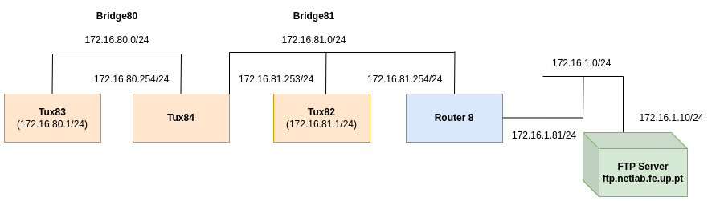
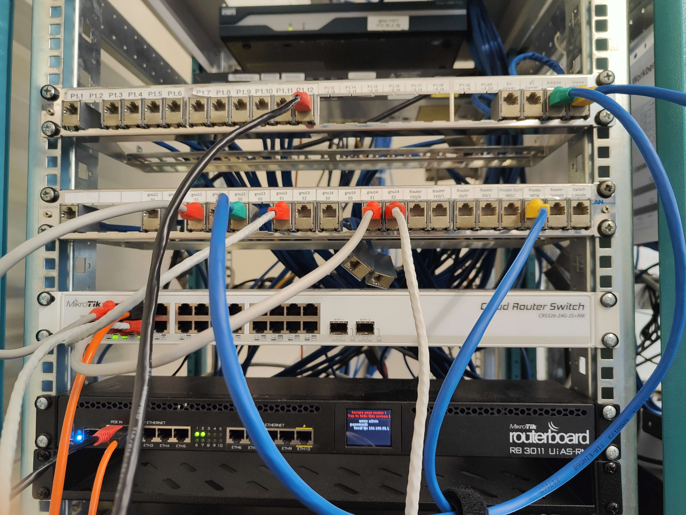

# Experiência 4
A experiência foi realizada na bancada nº8, logo o valor de Y = 8.

## Objetivo da experiêcia
A  quinta experiência tem como objetivo configurar os tuxes para usar o DNS server *services.netlab.fe.up.pt* (10.227.20.3). e assim podermos aceder ao FTP server usando um hostname.
## Arquitetura da rede
**Rede da experiência 5 (e 4)** - A rede da experiência 5 é igual à rede configurada na experiência 4. A rede configurada na experiência 4 das aulas laboratoriais é composta por três computadores, designados como tux2, tux3 e tux4, por um switch Mikrotik Router Switch e por um router comercial. Os três computadores e o router comercial estão dividos em duas bridges, bridge80 e bridge81.

- **IP da subrede 80** - 172.16.80.0/24
- **IP da subrede 81** - 172.16.81.0/24
- **IP do tux2** - 172.16.81.1/24
- **IP do tux3** - 172.16.80.1/24
- **IP do tux4 (eth1)** - 172.16.80.254/24
- **IP do tux4 (eth2)** - 172.16.81.253/24
- **IP router comercial (eth1)** - 172.16.1.81/24
- **IP router comercial (eth2)** - 172.16.81.254/24
- **IP broadcast (subrede 80)** - 172.16.80.255/24
- **IP broadcast (subrede 81)** - 172.16.81.255/24




## Configuração dos cabos
### Switch 
|Régua | Switch (porta)|
|----------|----------|
| gnu12-e1 | 2        |
| gnu13-e1 | 3        |
| gnu14-e1 | 4        |
| gnu14-e2 | 11        |
| router (eth2) | 6   |


### Consola
Em todas as experiência o GTKterminal está conectado no gnu13-s0. Isto significa que só é possivel aceder às funcionalidades do GTKterminal a partir do Tux83. (RS232->cisco para gnu13-s0)
Dentro do GTKterminal, podemos alterar funcionalidades do switch ou do router comercial. Se quiser usar o switch ligo um cabo de rs232 a porta consola do switch (cisco->RS232 para console). Se quiser usar o router ligo um cabo de rs232 a porta router MTIK da régua.



**Cabo amarelo** -> Determina qual dispositivo o GTKterminal está ligado.
**Cabo verde** -> Determina qual dos tuxes está a ser usado para o GTKterminal.

### Router
router(eth1) -> P1.12

## Comandos

### Experiência 5

**1** - Configurar todos os tuxes para usarem o DNS server `services.netlab.fe.up.pt` mudando o conteúdo do ficheiro `/etc/resolv.conf`.

```bash
nano /etc/resolv.conf
```

Mudamos o conteúdo do ficheiro `/etc/resolv.conf` para o seguinte:
    `nameserver 10.227.20.3`

**2** - Verificar se conseguimos usar o nome `services.netlab.fe.up.pt`


**Tux83**
```bash
ping services.netlab.fe.up.pt
```
Visto que o ping foi bem sucedido, verificamos que conseguimos usar o hostnae `services.netlab.fe.up.pt`. 

Abrimos o Wireshark e capturámos os pacotes lidos do Tux3, que se encontram no anexo `exp5.pcapng`.
